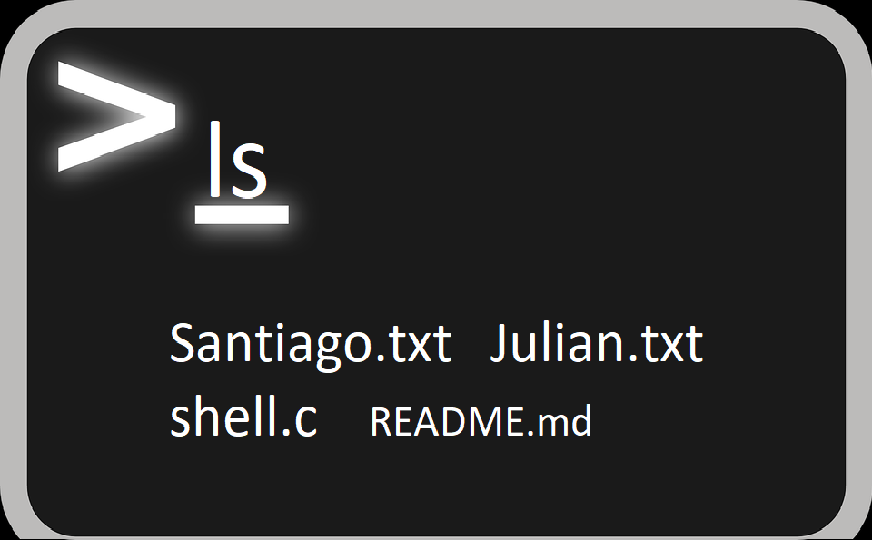
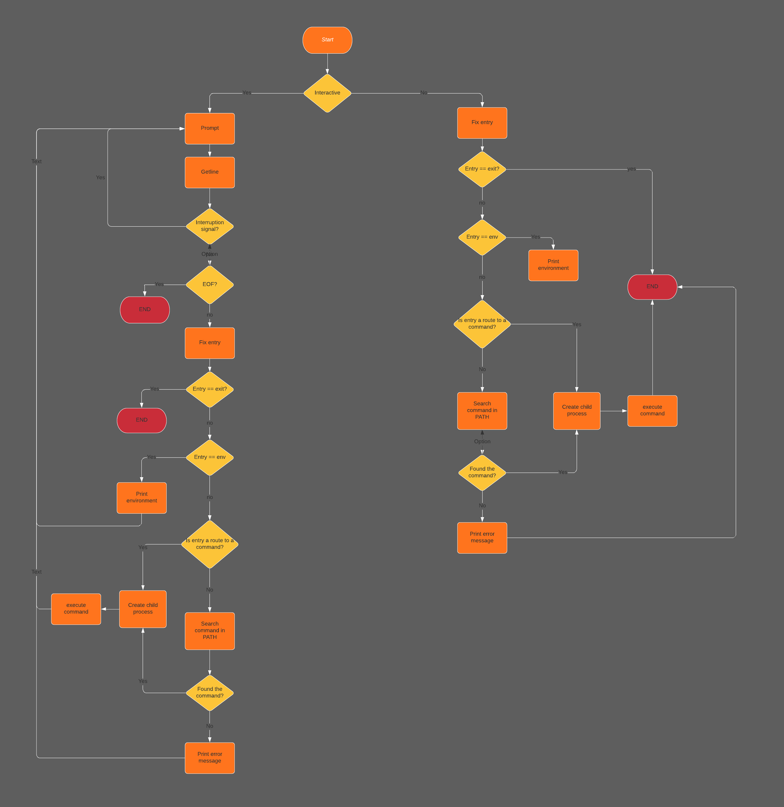
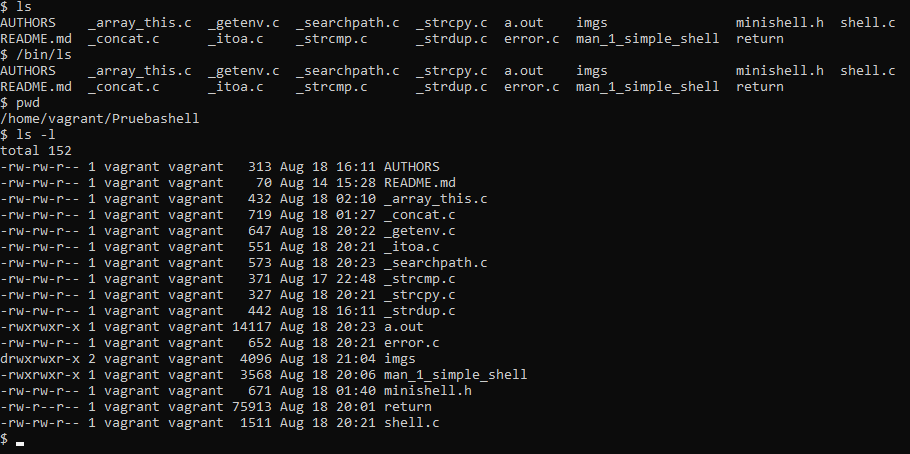
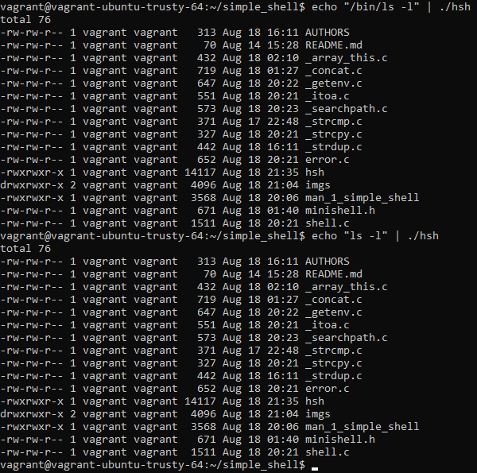

<p align="center"> 


## Project information 🚀

_Below, additional information that we had to take into account in order to develop the project, such as requirements and resources, will be presented. As well as the contact of the developers of this project._

## Compilation 💻

-Your code will be compiled this way:

```$ gcc -Wall -Werror -Wextra -pedantic *.c -o hsh```

### Requeriments 📌

* Allowed editors: vi, vim, emacs
* All your files will be compiled on Ubuntu 14.04 LTS
* Your C programs and functions will be compiled with gcc 4.8.4 using the flags -Wall -Werror -Wextra and -pedantic
* All your files should end with a new line
* A README.md file, at the root of the folder of the project is mandatory
* Your code should use the Betty style. It will be checked using betty-style.pl and betty-doc.pl
* Your shell should not have any memory leaks
* No more than 5 functions per file
* All your header files should be include guarded
* Use system calls only when you need to (why?)


### Resources 📋

 1. [Google](https://google.com)
 2. man or help:
    - sh (man sh)
    - write (man 2 write)
    - wait (man 2 wait)
    - strtok (man 3 strtok)
    - stat (man 2 stat)
    - signal (man 2 signal)
    - read (man 2 read)
    - perror (man 3 perror)
    - malloc (man 3 malloc)
    - isatty (man 3 isatty)
    - getline (man 3 getline)
    - free (man 3 free)
    - fork (man 2 fork)
    - exit (man 3 exit)
    - execve (man 2 execve)
    - close (man 2 close)

## Description

This project is motivated by the **[Holberton School](https://www.holbertonschool.com/)**
to realize this project you must have certain knowledge in the programming language that is made in our case "C", handling of concepts of the linux kernel, calls of the system and among others.

Our shell has certain behavior similar to the command sh in linux for more context "man sh".

## This is the flow of our shell:

<p align="center"> 


## shell in the mode interactive.

<p align="center"> 

## Shell in the mode no interactive

<p align="center"> 


## Wiki 📖

You can access the **[manual](./man_1_simple_shell)** to see precisely the functionalities.


## Authors ✒️

* **Julian Alvarez C.** - <a href="https://twitter.com/juliandavidal2"></a> <a href="https://www.instagram.com/cap.my.miaw/"></a>

* **Santiago Pinzón D.** - <a href="https://twitter.com/santiagopinzonD"></a> <a href="https://www.instagram.com/santiagopinzond/"></a>

